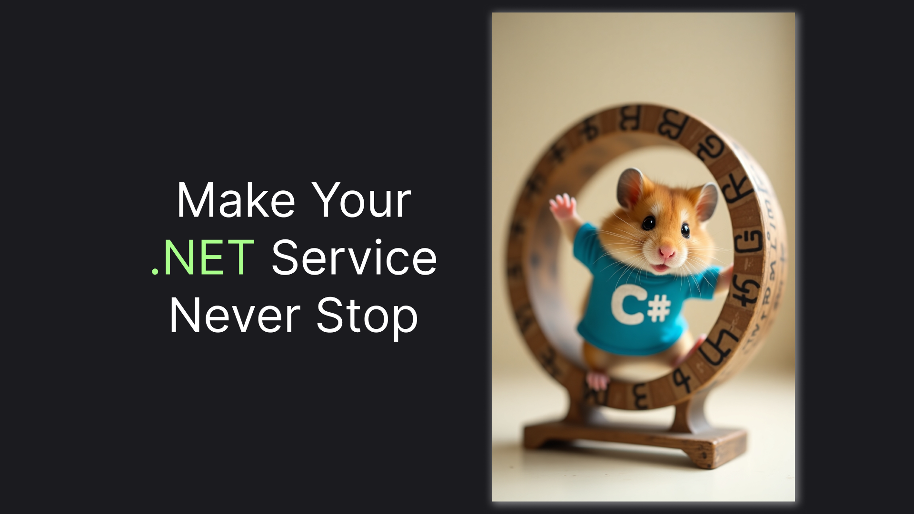

## How to Implement a .NET Background Service for Continuous Work in 2025

> Implementing an Ever-Running Background Service utilizing C# 11 feature - static virtual members in interfaces



.NET provides us with a built-in way to create a background service via `IHostedService` and its specific implementation - `BackgroundService`. However, there's not much infrastructure provided for common scenarios, so that falls on our shoulders. In [this article](https://medium.com/@vosarat1995/net-timers-all-you-need-to-know-d020c73b63a4), I've shown how we can run a periodic job using timers. In this article, we'll build a service that runs the same short operation safely on repeat for the life scope of our application.

> Or jump straight to the [TLDR;](#tldr) in the end of this article.

## First Implementation: Singleton-Based Iteration

Let's set up our playground app. We'll just use a minimalistic .NET template:

```sh
dotnet new web
```

Plus, update the logging to make it more compact:

```csharp
builder.Logging.AddSimpleConsole(c => c.SingleLine = true);
```

Now, we can move to the main part. An ever-running service - or a continuous background service, as we will call it in code - is basically a service that runs a work iteration over and over again, while the application is running. We'll utilize `stoppingToken` to determine whether our application is running or has reached its termination stage:

> It's easy to imagine an app needing multiple `ContinuousBackgroundService`. That's the main reason for having a generic argument for `<TIteration>`, so that each service can be easily distinguished by a DI container.

```csharp
public interface IContinuousWorkIteration
{
    Task Run(CancellationToken stoppingToken);
}

public class ContinuousBackgroundService<TIteration>(TIteration iteration) 
    : BackgroundService 
    where TIteration : IContinuousWorkIteration
{
    protected override async Task ExecuteAsync(CancellationToken stoppingToken)
    {
        while (!stoppingToken.IsCancellationRequested)
        {
            await iteration.Run(stoppingToken);
        }
    }
}
```

We'll also make a registration helper method to encapsulate the management of the life cycle of our service:

```csharp
public static partial class Registration
{
    public static IServiceCollection AddContinuousBackgroundService<TIteration>(this IServiceCollection services)
        where TIteration : class, IContinuousWorkIteration
    {
        services.AddSingleton<TIteration>();
        services.AddHostedService<ContinuousBackgroundService<TIteration>>();
        return services;
    }
}
```

Finally, let's implement the `IContinuousWorkIteration` to see our infrastructure in action:

```csharp
public class MyIteration(ILogger<MyIteration> logger) : IContinuousWorkIteration
{
    public async Task Run(CancellationToken stoppingToken)
    {
        logger.LogInformation("Running");
        await Task.Delay(1000);
        logger.LogInformation("Done");
    }
}
```

It's also important not to forget to register the background service:

```csharp
builder.Services.AddContinuousBackgroundService<MyIteration>();
```

With that in place, here's how our `Program.cs` should look:

```csharp
var builder = WebApplication.CreateBuilder(args);

builder.Logging.AddSimpleConsole(c => c.SingleLine = true);

builder.Services.AddContinuousBackgroundService<MyIteration>();

var app = builder.Build();

app.MapGet("/", () => "Hello World!");

app.Run();
```

Running the code with `dotnet run` should give us logs looking like that:


The logs mean our background service is working as expected! However, there are a few things that are not quite right. Let's fix them in the next sections.

## Second Iteration: Applying Scoped Lifecycle for the Iteration

The first problem is that we were using a singleton scope for our iteration. Although that worked in our example, it is typically not the right life cycle for an iteration. Normally, an iteration will depend on some external service, like a database which has a `Scoped` lifecycle. Consequently, we should make our iteration scoped, as well, and resolve it on each cycle of our loop. Here's how we are going to do that utilizing `IServiceScopeFactory`:

```csharp
public class ContinuousBackgroundService<TIteration>(IServiceScopeFactory scopeFactory) 
    : BackgroundService 
    where TIteration : IContinuousWorkIteration
{
    protected override async Task ExecuteAsync(CancellationToken stoppingToken)
    {
        while (!stoppingToken.IsCancellationRequested)
        {
            await using var scope = scopeFactory.CreateAsyncScope();
            var iteration = scope.ServiceProvider.GetRequiredService<TIteration>();

            await iteration.Run(stoppingToken);
        }
    }
}
```

These are almost all the changes we'll need to do in this section. The only thing left is to update our `Registration` utility to register our iteration with the proper scope:

```csharp
services.AddScoped<TIteration>();
```

Now, when we have fixed our lifecycle, let's move to the final updates, which utilize a new C# feature, which has appeared only in C# 11.

## Final Iteration: Making Iterations Safe with Exception Handling

For now, if an exception occurs during our iteration resolution or execution, it will completely stop our background service from running. Of course, this is not something we want. Instead, we should gracefully handle the exception and try to run our execution once again.

This is where C# 11 abstract static interface members come into play. Since we also want to handle exceptions on our iteration resolution, we can't use an instance of our iteration for the handling. Instead, we will force an `IContinuousWorkIteration` to implement a static exception handler, passing an `ILogger` from the `ContinuousBackgroundService` itself.

Here's how we will update our interface:

```csharp
public interface IContinuousWorkIteration
{
    Task Run(CancellationToken stoppingToken);
    abstract static Task OnException(Exception ex, ILogger logger);
}
```

And a typical implementation of the handler will just log the exception and sleep for some time. We will do the same in `MyIteration`:

```csharp
public static async Task OnException(Exception ex, ILogger logger)
{
    logger.LogError(ex, "An error occurred");
    await Task.Delay(500);
}
```

What we are going to do in `ContinuousBackgroundService` is wrap our whole code in a try-catch block, calling the iteration static exception handler:

> In theory, we could only wrap the `Run` method call in the try-catch block, removing the need for a static handler. However, there are some cases when resolution exceptions are transient (e.g., when a configuration value was broken in a remote configuration source) and we wouldn't want our background service to fall apart from those.

```csharp
try
{
    // resolve and run an iteration
}
catch (Exception ex)
{
    await TIteration.OnException(ex, logger);
}
```

Here's how the code will look as a whole:

```csharp
public class ContinuousBackgroundService<TIteration>(IServiceScopeFactory scopeFactory, ILogger<TIteration> logger) 
    : BackgroundService 
    where TIteration : IContinuousWorkIteration
{
    protected override async Task ExecuteAsync(CancellationToken stoppingToken)
    {
        while (!stoppingToken.IsCancellationRequested)
        {
            try
            {
                await using var scope = scopeFactory.CreateAsyncScope();
                var iteration = scope.ServiceProvider.GetRequiredService<TIteration>();
                
                await iteration.Run(stoppingToken);
            }
            catch (Exception ex)
            {
                await TIteration.OnException(ex, logger);
            }
        }
    }
}
```

This is the last fix we will need to do to make our small `ContinuousBackgroundService` fully functional. However, there's a way to not implement the service yourself. We will see it, along with the quick recap of the things we've implemented in the last section.

## TLDR;

In this article, we've implemented a base infrastructure for a background service running the same operation on repeat. Instead of implementing it again, you can just install the `Backi.Continuous` package:

```sh
dotnet add package Backi.Continuous
```

Then, implement your own `IContinuousWorkIteration` like this:

```csharp
public class MyIteration(ILogger<MyIteration> logger) : IContinuousWorkIteration
{
    public static async Task OnException(Exception ex, ILogger logger)
    {
        logger.LogError(ex, "An error occurred");
        await Task.Delay(500);
    }
    
    public async Task Run(CancellationToken stoppingToken)
    {
        logger.LogInformation("Running");
        await Task.Delay(1000);
        logger.LogInformation("Done");
    }
}
```

Finally, attach the continuous background service to the DI container:

```csharp
services.AddContinuousBackgroundService<MyIteration>()
```

Now, when running the application, you should get a log looking something like this:


And that wraps up our continuous background service infrastructure. This article, along with the `Backi.Continuous` package, is part of the bigger [backi](https://github.com/astorDev/backi) project, helping with various background-related stuff. Check it out on the [GitHub](https://github.com/astorDev/backi) and don't hesitate to give it a star! ⭐

Claps for this article are also highly appreciated! 😉
