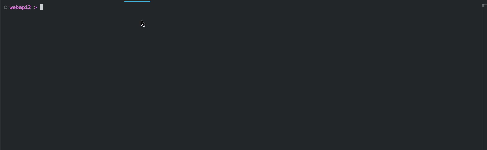

# .NET Timers: All You Need to Know

Periodically executing an action is a pretty common programming task, virtually any .NET developer will face sooner or later. In fact, the task is so common that .NET ships 3! different timers (not counting UI-specific timers). Sadly, Microsoft doesn't really provide a guide on which one to choose and how to use it in a real-world application. So let's experiment on our own!

## Preparing our app

To keep it real let's setup our experiments in a way we may actually use timers in a production-ready service: as an `IHostedService`. Let's init our project with a minimalistic web project: `dotnet new web` and then write a skeleton for our service, which will start a timer based on the values we will pass to it from the configuration

```csharp
public class HostedTimerService(IConfiguration configuration, ILogger<HostedTimerService> logger) : IHostedService
{
    public Task StartAsync(CancellationToken cancellationToken)
    {
        var timerType = configuration["Timer"];
        
        logger.LogInformation("Starting with timer {timerType}", timerType);

        Action startAction = timerType switch
        {
            "Threading" => StartThreadingTimer,
            "System" => StartSystemTimer,
            "Periodic" => StartPeriodicTimer,
            _ => () => { },
        };

        startAction();

        return Task.CompletedTask;
    }

    public Task StopAsync(CancellationToken cancellationToken)
    {
        logger.LogInformation("HostedTimerService stopped");
        return Task.CompletedTask;
    }

    public void StartSystemTimer()
    {
    }

    public void StartThreadingTimer()
    {
    }

    public void StartPeriodicTimer()
    {
    }
}
```

Now let's update our `Program.cs` to actually use the service, and to write compact logs:

```csharp
var builder = WebApplication.CreateBuilder(args);
builder.Logging.AddSimpleConsole(c => c.SingleLine = true);

builder.Services.AddHostedService<HostedTimerService>();

var app = builder.Build();

app.Run();
```

That's about it for setup. Running `dotnet run` should give us logs similar to the ones below:



Now let's start an actual experiment!

## System.Threading.Timer

First, let's define a simple method that will be executed each time our timer fires a callback. The method we'll do just two things: identify it was triggered and sometimes throw an exception:

```csharp
public void Tick()
{
    logger.LogInformation("Ticked at {time}", DateTime.Now);
    if (DateTime.Now.Second % 3 == 0)
    {
        throw new("Ticked at the wrong time");
    }
}
```

To start timer from the `System.Threading` namespace we'll provide a zero `dueTime`, meaning it should start immediately and 2 seconds `period`, meaning it should fire callback once in two seconds!

```csharp
public void StartThreadingTimer()
{
    _ = new Timer(
        callback: t => Tick(), 
        state: null, 
        dueTime: TimeSpan.Zero, 
        period: TimeSpan.FromSeconds(2)
    );
}
```

Running it by `dotnet run --timer=Threading` will print us the ticker response, but kill the whole application in case of a error:


Killing the whole app doesn't seem like a pleasable idea at all. Let's see what other timers have to offer.

## System.Timers.Timer

The timer from `System.Timers` utilizes events-based approach, to start it we'll need something like this:

```csharp
public void StartSystemTimer()
{
    var timer = new System.Timers.Timer(TimeSpan.FromSeconds(2));
    timer.Elapsed += (sender, e) => Tick();
    timer.Start();
}
```

Running it with `dotnet run --timer=System` will give us ticks without breaking the app.


> The timers waits for its interval before running for the first time. In my view, that's not something we want and we will address it later.

Although now the app doesn't break it also doesn't identify that an exception is occurring, which is not behaviour we want either. We'll need to handle that on our own. Let's add a configuration flag, that will highlight us that an exception is about to happen:

```csharp
public void Tick()
{
    var logTickError = configuration.GetValue("LogTickError", false);
    logger.LogInformation("Ticked at {time}", DateTime.Now);
    if (DateTime.Now.Second % 3 == 0)
    {
        if (logTickError) logger.LogError("Ticked at the wrong time");
        throw new("Ticked at the wrong time");
    }
}
```

Now with `dotnet run --timer=System --logTickError=true` will be able to see the occurring exceptions:


Although, that behaviour is more stable than the once we witnessed before it requires a dedicated effort for proper exception handling. This is especially worrying when the most straight-forward implementation leads to silenced exceptions and there's nothing indication that a dedicated effort should be done. Let's see what else we have.

## System.Threading.PeriodicTimer

`PeriodicTimer` was added in `.NET 6` and it is promoted by Microsoft as the modest modern and straight-forward way to implement the functionality we are seeking. Surprisingly, I find the code for timer most clumsy of all. 

```csharp
public void StartPeriodicTimer()
{
    var timer = new PeriodicTimer(TimeSpan.FromSeconds(2));
    Task.Run(async () =>
    {
        while (await timer.WaitForNextTickAsync())
        {
            Tick();
        }
    });
}
```

To make it worse running the code by `dotnet run --timer=Periodic` gives the most confusing behaviour, of just freezing in some point.


As you may have guessed the freezing occurs because of an occurred exception, which we can ensure by running our app with the previously added logging flag: `dotnet run --timer=Periodic --logTickError=true`


Unfortunately, the newest `PeriodicTimer` doesn't really solve any problem we have. So how about we build something different?

## SafeTimer

We'll build our timer on-top of the only timer that allows to trigger tick immediately: The one from the threading namespace.

```csharp
public class SafeTimer(Timer innerTimer)
```

You may notice the name for our new timer is `SafeTimer`. That's because our timer will protect us from an occuring exception killing our app, simultaneously identifying to us that we should do something with an occuring exception:

> We'll do two methods for synchronous and asynchronous operations

```csharp
private static TimerCallback TimerCallback(Action action, Action<Exception>? onException = null)
{
    return (_) =>
    {
        try {
            action();
        }
        catch (Exception ex) {
            onException?.Invoke(ex);
        }
    };
}

private static TimerCallback TimerCallback(Func<Task> action, Action<Exception>? onException = null)
{
    return async (_) =>
    {
        try {
            await action();
        }
        catch (Exception ex) {
            onException?.Invoke(ex);
        }
    };
}
```

Let's now provide the most unambiguous methods to run our timer, with asynchronous operations support included:

```csharp
private static SafeTimer RunNowAndPeriodically(TimerCallback callback, TimeSpan interval) {
    var innerTimer = new Timer(callback, null, TimeSpan.Zero, interval);
    return new(innerTimer);
}

public static SafeTimer RunNowAndPeriodically(TimeSpan interval, Action action, Action<Exception>? onException = null) {
    return RunNowAndPeriodically(TimerCallback(action, onException), interval);
}
    
public static SafeTimer RunNowAndPeriodically(TimeSpan interval, Func<Task> action, Action<Exception>? onException = null) {
    return RunNowAndPeriodically(TimerCallback(action, onException), interval);
}    
```

Now let's use our timer in the hosted service:

```csharp
public void StartSafeTimer() {
    _ = SafeTimer.RunNowAndPeriodically(
        TimeSpan.FromSeconds(2), 
        Tick, 
        ex => logger.LogError(ex, "Error in timer")
    );
}
```

And add an option to trigger it from the configuration

```csharp
"Safe" => StartSafeTimer,
```

With that, by running `dotnet run --timer=System` we will get a timer, that starts immediately and logs an occurring exception without freezing or killing our app:


This wraps the main part about timers. But how about we do one more cool thing with our newly created timer.

## Starting and Stopping

Let's also allow starting and stopping our timer. First, we'll need to allow creating our timer, without triggering it:

```csharp
private static SafeTimer Unstarted(TimerCallback callback)
{
    var innerTimer = new Timer(callback, null, Timeout.Infinite, Timeout.Infinite);
    return new(innerTimer);
}

public static SafeTimer Unstarted(Action action, Action<Exception>? onException = null) {
    return Unstarted(TimerCallback(action, onException));
}

public static SafeTimer Unstarted(Func<Task> action, Action<Exception>? onException = null) {
    return Unstarted(TimerCallback(action, onException));
}
```

All we have to do is to make a methods around tricky ways to start and stop our inner `Threading.Timer`:

```csharp
public void Stop() {
    innerTimer.Change(Timeout.Infinite, Timeout.Infinite);
}

public void Start(TimeSpan interval) {
    innerTimer.Change(TimeSpan.Zero, interval);
}
```

Now let's add a timer handles to our API:

```csharp
var timer = SafeTimer.Unstarted(
    () => app.Logger.LogInformation("Program timer ticked. {time:O}", DateTime.Now)
);

app.MapGet("/start", () => {
    timer.Start(TimeSpan.FromSeconds(1));
    return "Started!";
});

app.MapGet("/stop", () => {
    timer.Stop();
    return "Stopped!";
});
```

Then, after triggering it via `dotnet run` we should be able to `curl localhost:5601/start` and `curl localhost:5601/stop` it:


And this is our timer ladies and gentlemen! Now, let's take time to summarize our findings

## Recap

Since the sixth version .NET ships with 3 timers: `System.Threading.Timer`, `System.Timers.Timer`, and `System.Threading.PeriodicTimer`. We've experimented with them in our `HostedTimerService` and figured out the API and behaviour of each. Unfortunately, none of them comes with a simple API or exception handling. So we have created our own version on top of the `System.Threading.Timer`.

You can use the timer as a [nuget](https://www.nuget.org/packages/Backi.Timers) or check out the source code in [the github repo](https://github.com/astorDev/backi/tree/main/timers/dotnet/playground/webapi). And by the way... claps are appreciated 👏
