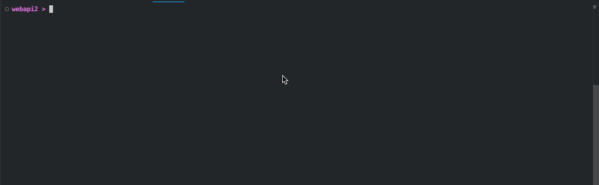

# .NET Timers: All You Need to Know

Periodically executing an action is a pretty common programming task, virtually any .NET developer will face sooner or later. In fact, the task is so common that .NET ships 3! different timers (not counting UI-specific timers). Sadly, Microsoft doesn't really provide a guide on which one to choose and how to use it in a real-world application. So let's experiment on our own!

## Preparing our app

```sh
dotnet new web
```

```csharp
public class HostedTimerService(IConfiguration configuration, ILogger<HostedTimerService> logger) : IHostedService
{
    public Task StartAsync(CancellationToken cancellationToken)
    {
        var timerType = configuration["Timer"];
        
        logger.LogInformation("Starting with timer {timerType}", timerType);

        Action startAction = timerType switch
        {
            "Threading" => StartThreadingTimer,
            "System" => StartSystemTimer,
            "Periodic" => StartPeriodicTimer,
            _ => () => { },
        };

        startAction();

        return Task.CompletedTask;
    }

    public Task StopAsync(CancellationToken cancellationToken)
    {
        logger.LogInformation("HostedTimerService stopped");
        return Task.CompletedTask;
    }


    public void StartSystemTimer()
    {
    }

    public void StartThreadingTimer()
    {
    }

    public void StartPeriodicTimer()
    {
    }
}
```

```csharp
var builder = WebApplication.CreateBuilder(args);
builder.Logging.AddSimpleConsole(c => c.SingleLine = true);

builder.Services.AddHostedService<HostedTimerService>();

var app = builder.Build();

app.Run();
```

```sh
dotnet run
```


## System.Threading.Timer

```csharp
public void Tick()
{
    logger.LogInformation("Ticked at {time}", DateTime.Now);
    if (DateTime.Now.Second % 3 == 0)
    {
        throw new("Ticked at the wrong time");
    }
}
```

```csharp
public void StartThreadingTimer()
{
    _ = new Timer(
        callback: t => Tick(), 
        state: null, 
        dueTime: TimeSpan.Zero, 
        period: TimeSpan.FromSeconds(2)
    );
}
```

```sh
dotnet run --timer=Threading
```


## System.Timers.Timer

```csharp
public void StartSystemTimer()
{
    var timer = new System.Timers.Timer(TimeSpan.FromSeconds(2));
    timer.Elapsed += (sender, e) => Tick();
    timer.Start();
}
```

```sh
dotnet run --timer=System
```


```csharp
public void Tick()
{
    var logTickError = configuration.GetValue("LogTickError", false);
    logger.LogInformation("Ticked at {time}", DateTime.Now);
    if (DateTime.Now.Second % 3 == 0)
    {
        if (logTickError) logger.LogError("Ticked at the wrong time");
        throw new("Ticked at the wrong time");
    }
}
```

```sh
dotnet run --timer=System --logTickError=true
```


## System.Threading.PeriodicTimer

```csharp
public void StartPeriodicTimer()
{
    var timer = new PeriodicTimer(TimeSpan.FromSeconds(2));
    Task.Run(async () =>
    {
        while (await timer.WaitForNextTickAsync())
        {
            Tick();
        }
    });
}
```

```sh
dotnet run --timer=Periodic
```



```sh
dotnet run --timer=Periodic --logTickError=true
```


## SafeTimer

```csharp
public class SafeTimer(Timer innerTimer)
```

```csharp
private static TimerCallback TimerCallback(Action action, Action<Exception>? onException = null)
{
    return (_) =>
    {
        try {
            action();
        }
        catch (Exception ex) {
            onException?.Invoke(ex);
        }
    };
}

private static TimerCallback TimerCallback(Func<Task> action, Action<Exception>? onException = null)
{
    return async (_) =>
    {
        try {
            await action();
        }
        catch (Exception ex) {
            onException?.Invoke(ex);
        }
    };
}
```

```csharp
private static SafeTimer RunNowAndPeriodically(TimerCallback callback, TimeSpan interval) {
    var innerTimer = new Timer(callback, null, TimeSpan.Zero, interval);
    return new(innerTimer);
}

public static SafeTimer RunNowAndPeriodically(TimeSpan interval, Action action, Action<Exception>? onException = null) {
    return RunNowAndPeriodically(TimerCallback(action, onException), interval);
}
    
public static SafeTimer RunNowAndPeriodically(TimeSpan interval, Func<Task> action, Action<Exception>? onException = null) {
    return RunNowAndPeriodically(TimerCallback(action, onException), interval);
}    
```

```csharp
"Safe" => StartSafeTimer,
```

```csharp
public void StartSafeTimer() {
    _ = SafeTimer.RunNowAndPeriodically(
        TimeSpan.FromSeconds(2), 
        Tick, 
        ex => logger.LogError(ex, "Error in timer")
    );
}
```


## Starting and Stopping

```csharp
private static SafeTimer Unstarted(TimerCallback callback)
{
    var innerTimer = new Timer(callback, null, Timeout.Infinite, Timeout.Infinite);
    return new(innerTimer);
}
```

```csharp
public void Stop() {
    innerTimer.Change(Timeout.Infinite, Timeout.Infinite);
}

public void Start(TimeSpan interval) {
    innerTimer.Change(TimeSpan.Zero, interval);
}
```

```csharp
var timer = SafeTimer.Unstarted(
    () => app.Logger.LogInformation("Program timer ticked. {time:O}", DateTime.Now)
);

app.MapGet("/start", () => {
    timer.Start(TimeSpan.FromSeconds(1));
    return "Started!";
});

app.MapGet("/stop", () => {
    timer.Stop();
    return "Stopped!";
});
```


## Recap

Since the sixth version .NET ships with 3 timers: `System.Threading.Timer`, `System.Timers.Timer`, and `System.Threading.PeriodicTimer`. We've experimented with them in our `HostedTimerService` and figured out the API and behaviour of each. Unfortunately, none of them comes with a simple API or exception handling. So we have created our own version on top of the `System.Threading.Timer`.

You can use the timer as a [nuget](https://www.nuget.org/packages/Backi.Timers) or check out the source code in [the github repo](https://github.com/astorDev/backi/tree/main/timers/dotnet/playground/webapi). And by the way... claps are appreciated 👏
